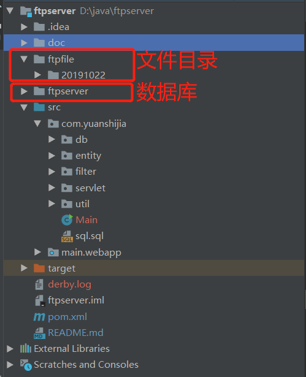

# ftp服务端
需要JDK8+，服务端端口为8080
## 启动
运行Main即可(数据库不存在会自动创建)

### 说明
* Constants全局常量类中，SAVE_PATH为保存文件的目录，默认为项目根目录下的ftpfile文件夹下
* ftpserver为数据库名称
* filter包下的ServerFilter类为全局过滤器
* entity包下有FileInfo文件信息实体类

### 文件说明

